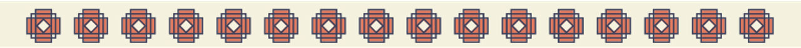

 

 

# Hello!!! I'm Grasiela Rosa 👋 👋

## Front-end Trainee

#### Skills:

- HTML
- CSS
- Javascript
- Bootstrap5
- Sass
- Typescript
- React

 

#### Idioms

- Native Portuguese
- Fluent Spanish
- C1 English

   

   

    

### _*I've been studing a [front-end career](https://adaitw.org/carreras/) at [Ada ITW](https://adaitw.org/) and looking for my first opportunity as a developer.*_

  
 
### *_Let's connect!_*

   

> _Illustrations by_ [Gabriela Lazzari](https://www.behance.net/gabilazzari).
